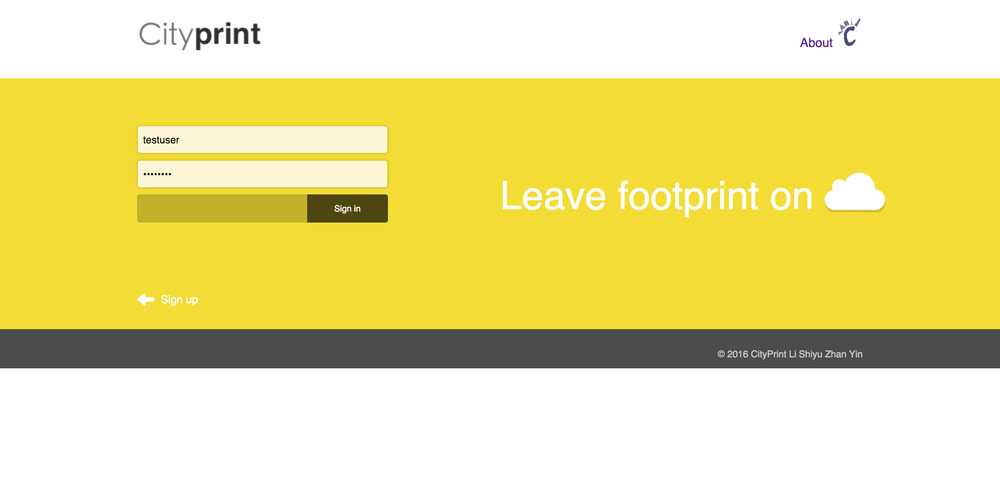
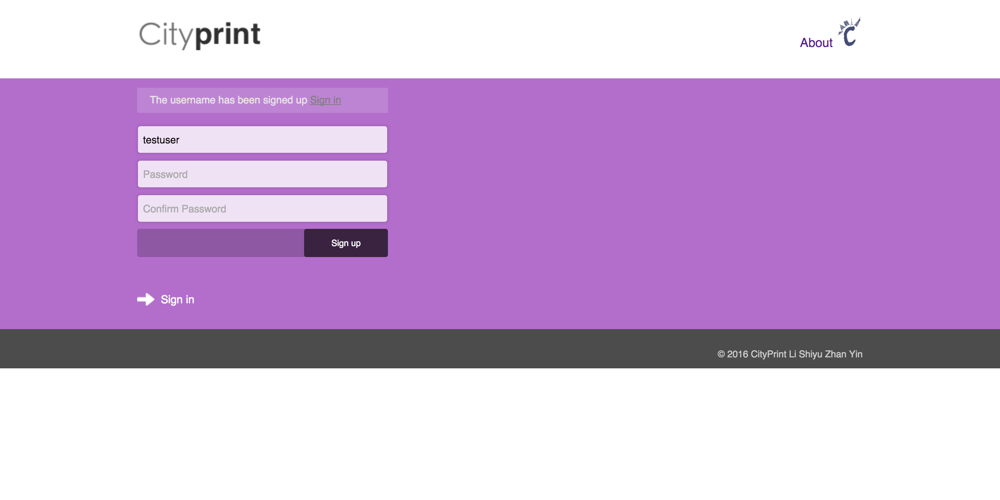
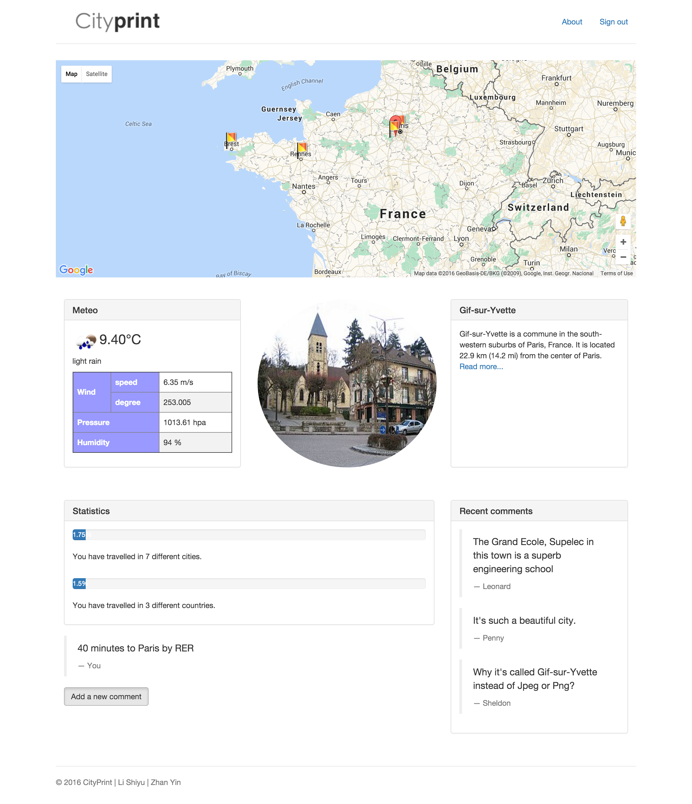

# A propos de Cityprint

*LI Shiyu* and *ZHAN Yin*


## Introduction

Cityprint est une web application qui on permet de noter les villes que l'on a visitées. Après s'est connecté, l'applications peut détecter la coordonnée d'utilisateur et la sauvegarder automatiquement dans le serveur. Avec Cityprint, on peut voir nos parcours dans le monde et on est encouragé à explorer le territoire inconnu.

Cityprint fournit aussi les informations pratiques telles que l'introduction et la météo de la location d'utilisateur. De plus, on peut partager nos impressions des villes.

## Diagrammes de séquences

Cette application peut être séparée en 3 parties : client, serveur et base de donnée.

## Techniques utilisés

- HTML, CSS, Javascript, JQuery, AJAX, JSON
- Node.js
- MySQL

## Modèle de donnée

Il y a 3 tables dans la base de donnée : ```User```, ```City``` et ```Visit``` comme ceux qui sont montrés ci-dessous. Les clés en gras sont primaires.

|User|
|----|
|**username**|
|password|

|City|
|----|
|cityname|
|country|
|latitude|
|longitude|
|**cid** = "\<latitude>,\<longitude>"|

|Visit|
|-----|
|**username**|
|**cid**|
|time|
|impression|
|imptime|

## Web pages

### Log in page



C'est la page pour se connecter. Le champs de nom d'utilisateur peut détecter si le nom existe déjà dans la base de donnée tant que l'entrée est terminée.

La couleur au fond se change chaque seconde.

### Sign up page



De même, on peut aussi tester si le nom d'utilisateur est valide ou pas juste après l'entrée. D'ailleurs, on détecte si les 2 mots de passe sont exactement pareils. Dans cette figure, le nom ```testuser``` est déjà utilisé par d'autres, donc on a une remarque au-dessus du formulaire.

### Page principale



Cette page contient une carte dans laquelle toutes les villes visitées sont indiquées. Etant donnée la location actuelle, la météo est une petite introduction sont présentés au milieu de la page. Les commentaires plus récents sont affichés à la fin. On peut commenter et renouveler son ancien commentaire.

## Routière de serveur

### GET

- '/' : la page principale qui contient une carte et l'information de ville.
- '/login' : la page pour se connecter
- '/logout' : déconnecter
- '/visit' : interface d'ajax, noter la location actuelle en renvoyer les informations corrélées
- '/checkusername' : interface d'ajax, examiner si le nom d'utilisateur est déjà dans la base de donnée
- '/about' : cette page

### POST

- '/reg' : registrer nouveau utilisateur
- '/login' : se connecter
- '/impression' : commenter en une ville

## Déploîment

Cette application est déployée sur [Openshift plate-form](http://cityprint-thierry.rhcloud.com/).

## Ressources extérieures

Cityprint est enforci par les ressource extérieures. 

La carte est fournie par Google Map et les informations de ville sont alimentées par Google Map Geocoding et Wikipedia. La météo vient d'OpenWeatherMap. Bootstrap, un magnifique cadre de front-end nous donne les composants jolies et intéressantes. PaaS de Openshift nous permet de déployer l'application en ligne.

- Google Map
- Google Map Geocoding API
- OpenWeatherMap API
- Wikipedia API
- Openshift Plateform
- Bootstrap